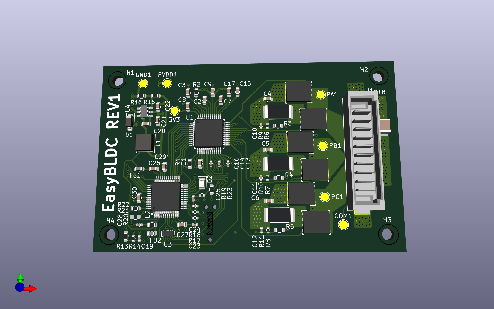

# Easy BLDC

## Overview
Easy BLDC is an open source sensorless FOC brushless dc motor driver designed for propeller thrust applications such as drones or underwater AUVS.

## Features
-30V Maximum Input Voltage
-20A Maximum Continues Current (Untested)
-High current Amphenol power blade connector for board-board mounting
-High efficency FOC algorithm
-Modifiable parameters via Ti MotorWare® GUI

## Why FOC?
FOC is the most advanced of the three common algorithms. Unlike trapezoidal or sinusoidal control, which energize the motor’s phases based on predefined waveforms, FOC actively keeps tracks the stators exact position. This allows for precise control of both torque and speed by decoupling the motor’s magnetic field into two components: one that controls the motor's flux and the other that controls the torque. FOC is extremely efficient, especially at higher speeds, and results in the smoothest possible operation at lower speeds. However, it comes at the cost of greater computational complexity and more demanding hardware requirements.

## Key Components
-Texas Instruments DRV8305 gate driver
- Texas Instruments InstaSpin® TMS320F28027F MCU

## Ordering Guide
TODO:

## Getting Started Guide
TODO:

## Motor Tuning Guide
TODO:

## Contribution Guidelines
We welcome contributions from the broader community. To contribute:

1. **Fork the Repository**: Create your own fork of the project.
2. **Create a Feature Branch**: Make your changes in a new branch.
3. **Commit Your Changes**: Commit your changes with clear and detailed commit messages.
4. **Submit a Pull Request**: Create a pull request for your changes to be reviewed.

Please ensure your designs meet common standards and include necessary documentation and comments.

## Project Status
- Version 1: Released
- Version 2: In  Progress

## License
This project is licensed under the [MIT License](LICENSE) - see the LICENSE file for details.

## Contact
- Designer: Peter Buckley
- Email: peterbuckley3636@gmail.com
